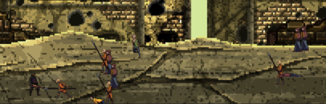
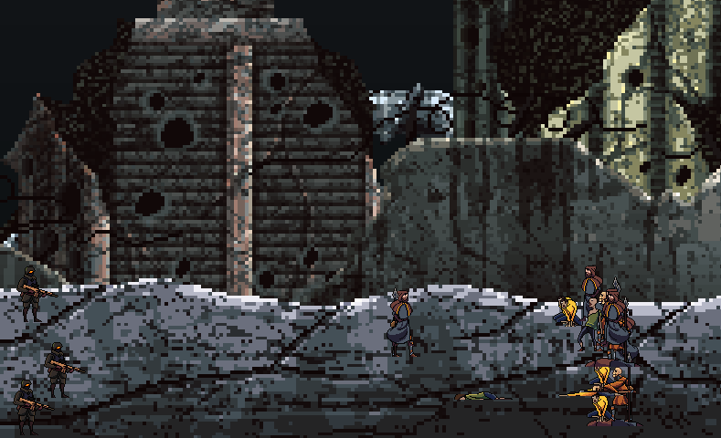
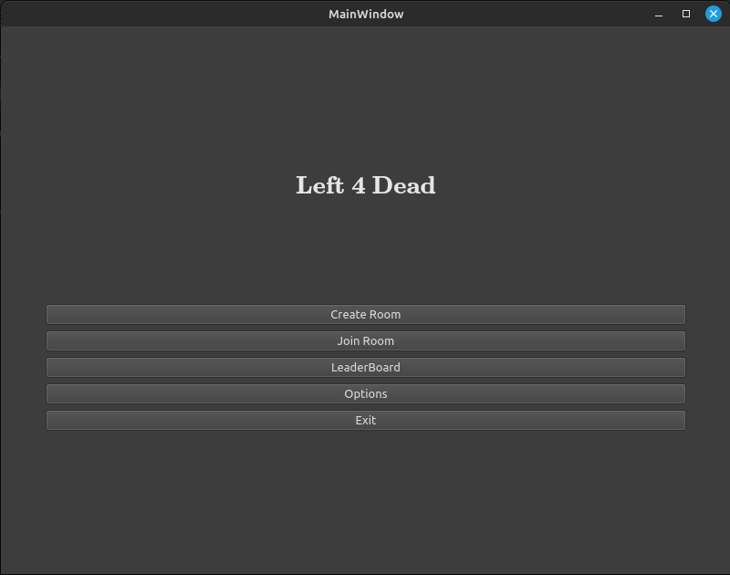
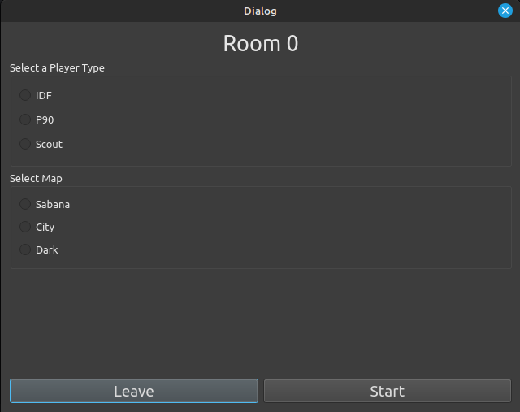

# left4dead
TP Grupal de Taller de Programación

Para buildear el proyecto:
```
chmod +x install.sh
./install.sh
```

Para crear el servidor:
```
cd build
./server <puerto>
```

Para crear el cliente:
```
cd build
./client <ip> <puerto>
```

Para correr los tests:
```
cd build
./test
```

## Features del juego
- [x] Lobby en Qt
- [x] Background Scrolling
- [x] Adaptable a distintas resoluciones
- [x] Barras de vida y municiones
- [x] Animaciones de los personajes
- [x] Animaciones de los zombies
- [x] 3 mapas distintos (uno por nivel)
- [x] 3 soundtracks distintos (uno por nivel)
- [x] 3 niveles distintos
- [x] Colisión de players
- [x] Limites de mapa
- [x] Daño por balas y ataques meles
- [x] Witch (zombie especial)
- [x] Infected (zombie común)
- [x] Instalador por script
- [x] LeaderBoard
- [x] Multiplayer

# Imágenes del juego

Más imagenes en carpeta images
## In-game



## Lobby



---

## Manual de Usuario
Link overleaf: https://www.overleaf.com/1192774991qypxvjbgnwrb
Esta el pdf en el directorio principal del proyecto.

## Manual del proyecto y documentación técnica
Link overleaf: https://www.overleaf.com/project/6498abd3c81ecb7ca80ae8b0
Esta el pdf en el directorio principal del proyecto.

## Diagrama de Robustez
Link PlantUML: www.plantuml.com/plantuml/png/FOx1IiOm48Jl-nHBJXRyyLv4VkX12Wg5uWDiazKgIIERhT2tbtH3JmiptyxClIY9xYb2FqKwM7gytLxmuIqloz51kwQzKk8EBksvQk-aVksmnsgEuJ7hoeBZzfd1UCDc9TrBvOQLXBoo50oa132p_B5OWwL1kwQrLm1tzg8N9kMdd_ozuHSbTaZbskicoPfzZZYS69v9XhHmz_4RgbFNeOMRVnNTUGjxYly0
